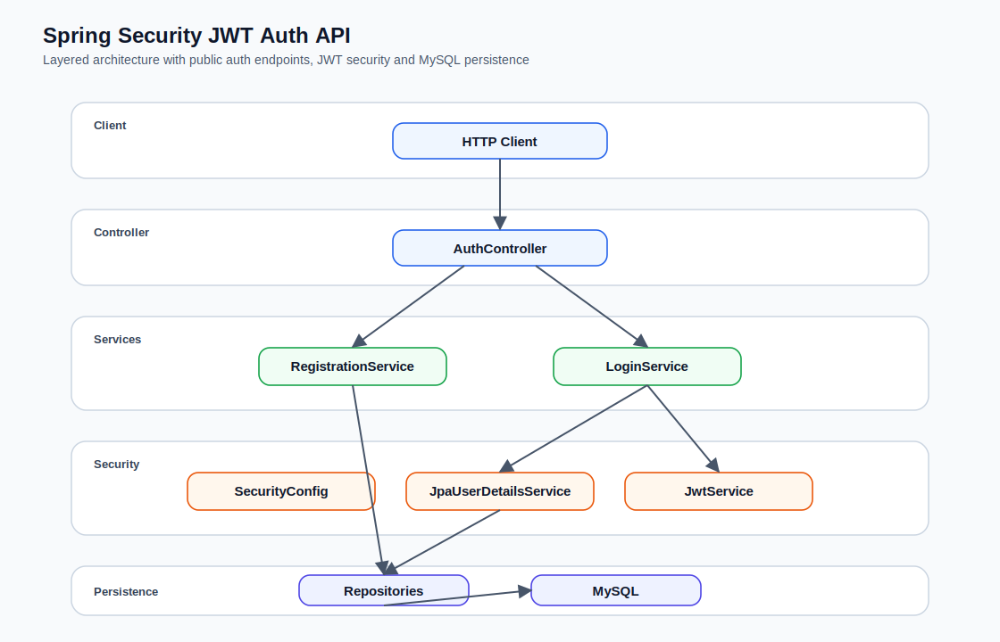
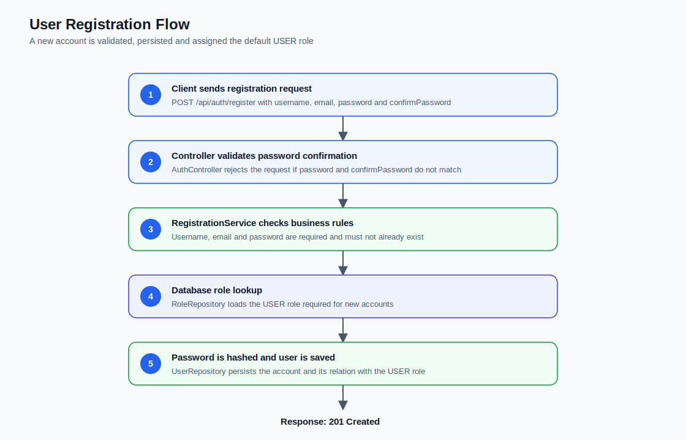
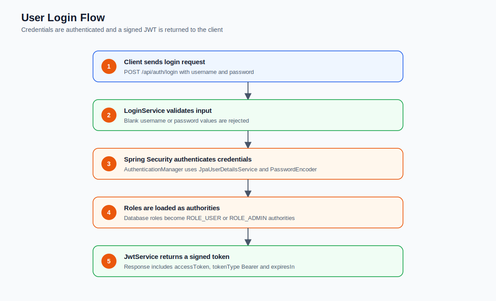
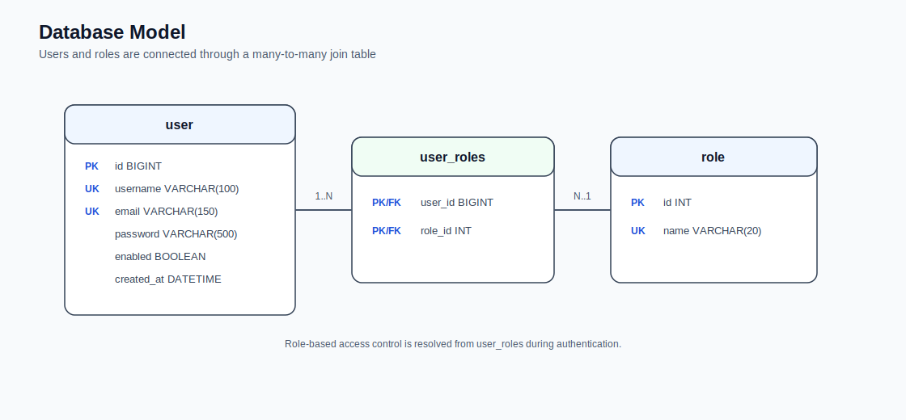

<div align="center">

# Spring Security JWT Auth API

Professional backend authentication API built with Spring Boot, Spring Security, JWT, Spring Data JPA and MySQL.


<br />
<br />


</div>

## Overview

This project is a REST API for user registration and login. It implements stateless authentication with Spring Security and JSON Web Tokens, persists users and roles in MySQL, and protects routes through role-based access control.

It is my first hands-on project with Spring Security. I built it to understand how authentication, password hashing, JWT generation, user persistence and role-based authorization work together in a Java backend.

I greatly appreciate receiving contributions, suggestions, code reviews and learning-oriented improvements.

## Main Features

- Register users with username, email, password and password confirmation.
- Authenticate users with username and password.
- Hash passwords with Spring Security `PasswordEncoder`.
- Generate signed JWT access tokens using HS256.
- Protect endpoints with stateless Bearer token authentication.
- Resolve permissions through role-based access control.
- Store users and roles with Spring Data JPA and MySQL.
- Document architecture, flows and database structure with SVG diagrams.

## Tech Stack

| Technology | Purpose |
| --- | --- |
| Java 21 | Main language |
| Spring Boot 4.1.0 | Application framework |
| Spring Web MVC | REST API layer |
| Spring Security | Authentication and authorization |
| OAuth2 Resource Server | JWT validation support |
| Spring Data JPA | Persistence layer |
| MySQL | Relational database |
| Maven | Build and dependency management |
| JUnit / Spring Boot Test | Test support |

## Architecture

The API follows a simple layered architecture. The controller receives HTTP requests, services execute authentication logic, repositories access MySQL, and Spring Security handles credentials, roles and JWT validation.



## Project Structure

```text
src/main/java/com/example/crm
├── CrmApplication.java
├── controllers
│   └── AuthController.java
├── dtos
│   ├── LoginRequest.java
│   ├── LoginResponse.java
│   └── RegisterRequest.java
├── models
│   ├── Role.java
│   └── User.java
├── repositories
│   ├── RoleRepository.java
│   └── UserRepository.java
├── security
│   ├── JpaUserDetailsService.java
│   └── SecurityConfig.java
└── services
    ├── JwtService.java
    ├── LoginService.java
    └── RegistrationService.java
```

## API Summary

| Method | Endpoint | Access | Description |
| --- | --- | --- | --- |
| `POST` | `/api/auth/register` | Public | Creates a new user account |
| `POST` | `/api/auth/login` | Public | Authenticates a user and returns a JWT |
| Any | `/admin/**` | `ADMIN` role | Admin-only route group |
| Any | Other routes | Authenticated users | Requires a valid Bearer token |

## Role-Based Access Control

This API uses role-based access control.

Users are connected to roles through the `user_roles` table. During login, `JpaUserDetailsService` loads the user's roles from the database and converts them into Spring Security authorities using the `ROLE_` prefix.

Current roles:

| Role | Purpose |
| --- | --- |
| `USER` | Default role assigned to registered users |
| `ADMIN` | Required to access `/admin/**` routes |

Access rules:

| Route | Rule |
| --- | --- |
| `POST /api/auth/register` | Public |
| `POST /api/auth/login` | Public |
| `/admin/**` | Requires `ROLE_ADMIN` |
| Any other route | Requires a valid JWT |

## Security Model

- The API is stateless.
- CSRF protection is disabled because the API does not use server-side sessions.
- Form login and logout are disabled.
- Passwords are stored hashed, not in plain text.
- JWT tokens are signed and verified with HS256.
- The JWT includes the authenticated username and user roles.
- Protected requests must use the `Authorization: Bearer <token>` header.

JWT response format:

```json
{
  "accessToken": "jwt-token-value",
  "tokenType": "Bearer",
  "expiresIn": 3600
}
```

## Registration Flow



## Login Flow



## Database Model

The database stores users, roles and the many-to-many relationship between them.



| Table | Description |
| --- | --- |
| `user` | Stores account credentials and status |
| `role` | Stores available roles such as `USER` and `ADMIN` |
| `user_roles` | Links users with their assigned roles |

## API Reference

### Register User

```http
POST /api/auth/register
Content-Type: application/json
```

Request body:

```json
{
  "username": "john",
  "email": "john@example.com",
  "password": "secret123",
  "confirmPassword": "secret123"
}
```

Successful response:

```http
201 Created
```

```json
{
  "message": "User registered successfully"
}
```

Common errors:

```json
{
  "error": "Passwords do not match"
}
```

```json
{
  "error": "Username already exists"
}
```

```json
{
  "error": "Email already exists"
}
```

### Login User

```http
POST /api/auth/login
Content-Type: application/json
```

Request body:

```json
{
  "username": "john",
  "password": "secret123"
}
```

Successful response:

```json
{
  "accessToken": "jwt-token-value",
  "tokenType": "Bearer",
  "expiresIn": 3600
}
```

Invalid credentials:

```http
401 Unauthorized
```

```json
{
  "error": "Invalid username or password"
}
```

## Configuration

Main configuration file:

```text
src/main/resources/application.properties
```

Current configuration:

```properties
spring.application.name=crm

spring.datasource.url=jdbc:mysql://localhost:3306/crm?createDatabaseIfNotExist=true&useSSL=false&allowPublicKeyRetrieval=true&serverTimezone=UTC
spring.datasource.username=${DB_USERNAME:root}
spring.datasource.password=${DB_PASSWORD:root}
spring.datasource.driver-class-name=com.mysql.cj.jdbc.Driver

spring.jpa.hibernate.ddl-auto=update

app.jwt.secret=${JWT_SECRET:replace-this-development-secret-with-at-least-32-bytes}
app.jwt.expiration-minutes=60
```

Environment variables:

| Variable | Description | Default |
| --- | --- | --- |
| `DB_USERNAME` | MySQL username | `root` |
| `DB_PASSWORD` | MySQL password | `root` |
| `JWT_SECRET` | Secret used to sign JWT tokens | Development fallback |

Example:

```bash
export DB_USERNAME="root"
export DB_PASSWORD="root"
export JWT_SECRET="change-this-secret-to-a-secure-value-32-bytes-minimum"
```

## Database Setup

Hibernate is configured with `spring.jpa.hibernate.ddl-auto=update`, so the application can create or update tables automatically during development.

If you want to create the database structure manually, use the following SQL:

```sql
CREATE DATABASE IF NOT EXISTS crm;

USE crm;

CREATE TABLE IF NOT EXISTS role (
  id INT AUTO_INCREMENT PRIMARY KEY,
  name VARCHAR(20) NOT NULL UNIQUE
);

CREATE TABLE IF NOT EXISTS `user` (
  id BIGINT AUTO_INCREMENT PRIMARY KEY,
  username VARCHAR(100) NOT NULL UNIQUE,
  email VARCHAR(150) NOT NULL UNIQUE,
  password VARCHAR(500) NOT NULL,
  enabled BOOLEAN NOT NULL,
  created_at DATETIME NOT NULL
);

CREATE TABLE IF NOT EXISTS user_roles (
  user_id BIGINT NOT NULL,
  role_id INT NOT NULL,
  PRIMARY KEY (user_id, role_id),
  CONSTRAINT fk_user_roles_user
    FOREIGN KEY (user_id) REFERENCES `user` (id),
  CONSTRAINT fk_user_roles_role
    FOREIGN KEY (role_id) REFERENCES role (id)
);

INSERT IGNORE INTO role (name)
VALUES ('USER'), ('ADMIN');
```

The `USER` role is required for registration. New accounts are automatically assigned this role. If the role does not exist, registration will fail with:

```text
USER role does not exist
```

Recommended local setup:

1. Start MySQL.
2. Create the `crm` database.
3. Start the Spring Boot application once.
4. Insert the `USER` and `ADMIN` roles if they do not exist.
5. Register a user through `/api/auth/register`.

## Running Locally

Requirements:

- Java 21
- MySQL
- Terminal access

Run the application:

```bash
./mvnw spring-boot:run
```

Run tests:

```bash
./mvnw test
```

Build the project:

```bash
./mvnw clean package
```

Run the generated JAR:

```bash
java -jar target/crm-0.0.1-SNAPSHOT.jar
```

## Usage Examples

Register a user:

```bash
curl -X POST http://localhost:8080/api/auth/register \
  -H "Content-Type: application/json" \
  -d '{
    "username": "john",
    "email": "john@example.com",
    "password": "secret123",
    "confirmPassword": "secret123"
  }'
```

Login:

```bash
curl -X POST http://localhost:8080/api/auth/login \
  -H "Content-Type: application/json" \
  -d '{
    "username": "john",
    "password": "secret123"
  }'
```

Use a protected endpoint:

```bash
curl http://localhost:8080/protected-resource \
  -H "Authorization: Bearer <access-token>"
```

## Learning Goals

This project is part of my backend learning path and focuses on:

- Understanding Spring Security configuration.
- Implementing stateless authentication with JWT.
- Mapping database roles to Spring Security authorities.
- Structuring a backend API with controllers, services, repositories and DTOs.
- Writing clearer technical documentation for portfolio review.

## Roadmap

- Add automatic role seeding.
- Add request validation with `@NotBlank`, `@Email` and `@Size`.
- Add a global exception handler.
- Add integration tests for registration and login.
- Add refresh token support.
- Store tokens in secure cookies.
- Add OpenAPI/Swagger documentation.
- Add Docker Compose for MySQL.
- Add Flyway or Liquibase migrations.
- Add a CI workflow for tests and builds.

## Security Notes

- Do not use the development JWT secret in production.
- Store secrets in environment variables or a secret manager.
- Use HTTPS in production.
- TODO: Store authentication tokens in secure cookies using `HttpOnly`, `Secure` and `SameSite` attributes.
- Consider adding rate limiting for login attempts.
- Consider adding stronger password rules.
- Replace `ddl-auto=update` with migrations before production use.

## Contributions

This is my first project with Spring Security, and I greatly appreciate receiving feedback.

Contributions, suggestions, issue reports, code reviews and learning-oriented improvements are welcome.
